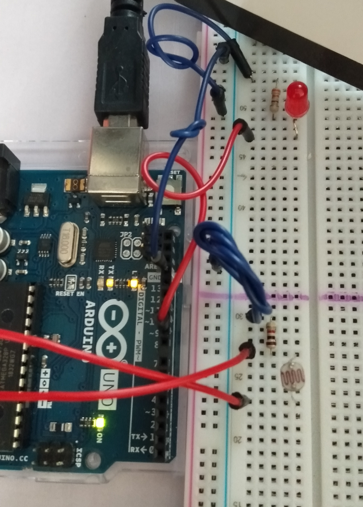
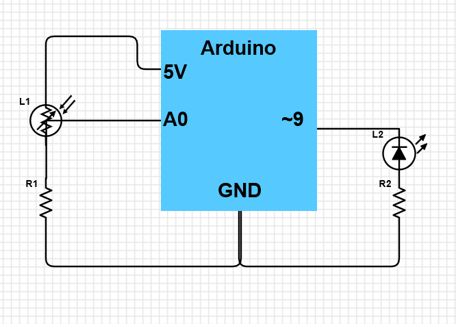

# Night_Light_w_CdS

  

Basic night light like the ones my parents had. When there is light, it's off; While dark, it turns on automatically. Simple enough.

This tiny project uses Arduino.

  

<b> The Circuit: </b>
<ul>
<li> Arduino </li>
<li> breadboard </li>
<li> jumpers (3 red, 3 blue)</li>
<li> LED (Red; pin ~9 )</li>
<li> 330 ohm resistor (pin ~9 and GND (PWR))</li>
<li> 10k ohm resistor (pin A0 and GND)</li>
<li> photoresistor (photosensor; pin A0 and 5V)</li>
</ul>

If anyone would like me to explain anything. Feel free to contact.

Feel free to have a look in my <a href="https://github.com/teiResa/Night_Light_w_CdS-Photosensor/issues/2"><i> notebook </i></a>. 
